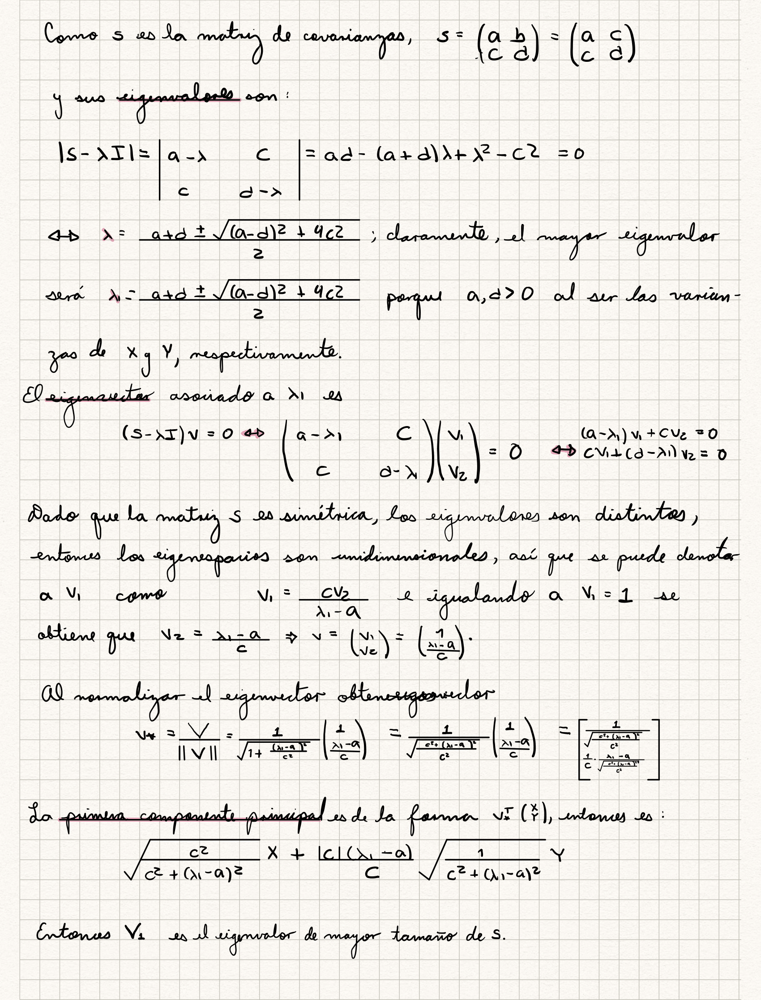

```{r}
set.seed(17032020) #created at date

number_ex <- 1:10 # 10 ejercicios
cat("\nEjericios Pablo: ")
(ex_pablo <- sample(x = number_ex,replace = F, size = 3))
number_ex <- number_ex[! number_ex %in% ex_pablo] #Removing questions

number_ex <- 1:10 # 10 ejercicios
cat("\nEjericios Roman: ")
(ex_roman <- sample(x = number_ex,replace = F, size = 3))
number_ex <- number_ex[! number_ex %in% ex_roman] #Removing questions

number_ex <- 1:10 # 10 ejercicios
cat("\nEjericios Sofia: ")
(ex_sofia <- sample(x = number_ex,replace = F, size = 3))
number_ex <- number_ex[! number_ex %in% ex_sofia] #Removing questions

```


##Ejercicio 1

```{r}
library('png')
```




##Ejercicio 4
Cargamos los datos y elegimos los que queremos analizar.
```{r}
DATA<-read.table("T110.DAT", header=F)
X<-DATA[,-c(1,2)]
```

Estandarizamos los datos porque sus unidades son distintas
```{r}
X_std <- scale(X)
```

Obtenemos la matriz de covarianzas

```{r}
cov<-cov(X_std)
```

Encontramos sus eigenvalores y eigenvectores. Un vector propio es una dirección y un valor propio es un número que indica cuánta varianza hay en los datos en esa dirección.

```{r}
ei<-eigen(cov)
```

El valor propio más grande es el primer componente principal; multiplicamos los valores estandarizados al primer vector propio. Aplicamos lo mismo para todos los vectores propios.

```{r}
comp <- matrix(data=NA, nrow=76, ncol=7)
for(j in 1:7){
    comp[,j] <- X_std %*% ei$vectors[,j]
   }
```

Mostemos que obtenemos lo mismo haciendolo con la matriz de correlaciones:
```{r}
cor<-cor(X_std)
ei_r<-eigen(cor)
comp_r <- matrix(data=NA, nrow=76, ncol=7)
for(i in 1:7){
    comp_r[,i] <- X_std %*% ei_r$vectors[,i]
   }
```

Calculamos la proporción de varianza total que explica cada componente y la acumulada
```{r}
eigv<-ei$values
rbind(
  SD = sqrt(eigv),
  Proportion = eigv/sum(eigv),
  Cumulative = cumsum(eigv)/sum(eigv))
```

#a)Determinar el número apropiado de componentes que resumen adecuadamente la variabilidad de los datos originales.

De acuerdo al cálculo anterior, las primeras 4 componentes explican el 95% de la variabilidad total.

#b)Interpretación de las componentes principales.
```{r}
(ei$vector)
```

Para la primera componente principal el signo solo cambia para la variable de grasa trasera, entonces podría interpretarse como un contraste entre la configuración "valiosa" y "no valiosa" en términos de carne del cuerpo.

La segunda tiene que la grasa trasera tiene el mayor peso, entonces se podría decir que la componente pondera las partes más pesadas.

La tercera contrasta el peso por venta dado cuanto del cuerpo estaba libre de grasa.

la cuarta contrasta lo que tiene el cuerpo por lo que se vende.

La quinta podría tener una interpretación parecida a la tercera.

La sexta contrapone las partes que no se venden del cuerpo.

La última resalta la medición al año y al momento de venta.

#c)¿Será posible desarrollar un índice ‘Tamaño de cuerpo’ o ‘configuración de cuerpo’ basado en las 7 variables consideradas? Expliquen

Fijandos en la primera componente, me parece que se podría obtener un buen indice. En donde la grasa trasera indicaría oposición con el resto de las variables.

#d Hacer una gráfica de las dos primeras componentes. ¿Hay outliers? Si los hay, hacer una sustitución de la matriz de covarianzas con una matriz de covarianzas estimada de manera robusta.

```{r}
plot(comp[,1:2], pch = 16, cex = 0.1)
text(comp, labels = 1:88, cex = 0.7) 
abline(h=0);abline(v=0)
```
Se aprecia que hay, por lo menos, dos outliers.
Sustituimos por una matriz de covarianzas estimada de manera robuzta. 
```{r}
cov_rob<-cov(X_std,method="spearman")
ei_rob<-eigen(cov_rob)
comp_rob <- matrix(data=NA, nrow=76, ncol=7)
for(i in 1:7){
    comp_rob[,i] <- X_std %*% ei_rob$vectors[,i]
}
plot(comp_rob[,1:2], pch = 16, cex = 0.1)
text(comp_rob, labels = 1:88, cex = 0.7) 
abline(h=0);abline(v=0)
```
#e) Evalúen si los datos originales son normales. Si no lo son, buscar las transformaciones que los acerquen a normalidad. Repetir el análisis con los datos transformados y probar la significancia de la varianza de las componentes principales con el resultado de Anderson

```{r}
lapply(X, shapiro.test)
```

Rechazamos la hipótesis de que sea normal para $V_4$, $V_6$, $V_7$. Entonces transformamos con la función Box Cox esos 3 vectores.

```{r}
library(car)
library(forecast)
X_norm<-X
for (i in c(2,4,5)){
  X_norm[,i]<-bcPower(X[,i],lambda=BoxCox.lambda(X[,i], method = "loglik", lower = 0, upper = 1) )
}
```

```{r}
lapply(X_norm, shapiro.test)
```

Los vectores $V_4$, $V_6$, $V_7$ siguen sin cumplir con la hipótesis de normalidad, pero se acercan a esto más que antes.

Calculamos todo de nuevo:

```{r}
X_norm<-as.matrix(X_norm)
co<-cov(X_norm)
e<-eigen(co)
com<- matrix(data=NA, nrow=76, ncol=7)
for(i in 1:7){
    com[,i] <- X_norm %*% e$vectors[,i]
}
plot(com[,1:2], pch = 16, cex = 0.1)
text(com, labels = 1:88, cex = 0.7) 
abline(h=0);abline(v=0)
```

Notemos que los valores propios son:

```{r}
e$values
```

La diferencia entre los dos últimos es muy pequeña:
```{r}
e$values[6]-e$values[7]
```

la diferencia entre el último y el antepenúltimo también es pequeña:
```{r}
e$values[5]-e$values[6]
```

Esto se cumple para los últimos tres eigenvalores:
```{r}
(dif1<-e$values[6]-e$values[7])
(dif2<-e$values[5]-e$values[6])
(dif3<-e$values[4]-e$values[5])
```

Se prueba, entonces, la significancia de los componentes grandes.Probando así el resultado de Anderson.


##Ejercicio 6
```{r}
matriz<-cbind(c(1,0.402,0.396,0.301,0.305,0.339,0.340),c(0.402,1,0.618,0.150,0.135,0.206,0.183),c(0.396,0.618,1,0.321,0.289,0.363,0.345),c(0.301,0.15,0.321,1,0.846,0.759,0.661),c(0.305,0.135,0.289,0.846,1,0.797,0.8),c(0.339,0.206,0.363,0.759,0.797,1,0.736),c(0.340,0.183,0.345,0.661,0.8,0.736,1))
eigen<-eigen(matriz)
loadings<-eigen$vectors
```

```{r}
z<-princomp(covmat=matriz)
z$loadings
```


